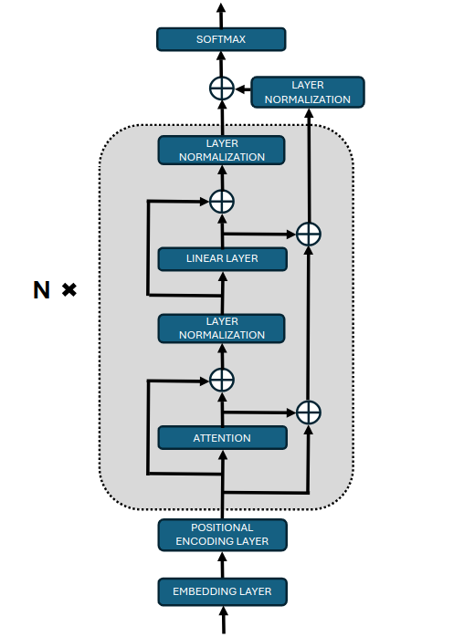

# Livia: Efficient Small Language Models with Architectural Innovations

We are excited to introduce **Livia**, a suite of Small Language Models (SLMs) developed by **Shodh AI**. Built on the foundation of our research paper, *[Livia: Towards Efficient Small Language Models—Enhancing Performance with Architectural Innovations](link_to_paper)*, this suite represents a significant step forward in delivering high-performance natural language processing (NLP) capabilities with minimal computational demands.

Our models are a refined adaptation of the [GPT-NeoX](https://github.com/EleutherAI/gpt-neox) framework, integrating several cutting-edge architectural innovations. These improvements enable Livia to deliver robust NLP performance, while dramatically reducing computational overhead—making it an ideal solution for resource-constrained environments.

## Table of Contents

- [Features](#features)
- [Architecture](#architecture)
- [Installation and Setup](#installation-and-setup)
- [Acknowledgements](#acknowledgements)
- [License](#license)
- [References](#references)

## Features

Our models leverage several architectural innovations:

- **Rotary Position Embedding (RoPE)**: Improves the encoding of positional information, enhancing the model's ability to understand long-range dependencies.

- **Grouped Query Attention (GQA)**: Reduces the number of parameters in the attention mechanism without compromising expressiveness, leading to more efficient utilization of model capacity.

- **SwiGLU Activation Function**: Increases the non-linear modeling capability of the feed-forward networks, allowing the model to capture complex relationships within the data.

- **Compressed Root Mean Square Normalization (CRMSNorm)**: Contributes to training stability and efficiency by normalizing activations in a compressed space, reducing computational overhead.

- **Dual-Residual Transformer Architecture**: Facilitates better gradient propagation by combining pre-normalization and post-normalization, mitigating issues like vanishing gradients and representation collapse.

## Architecture

Our models are based on a Decoder-only Transformer architecture inspired by GPT-NeoX, with the above innovations integrated to optimize for efficiency and performance.

*Figure: Overview of the Dual-Residual Transformer architecture.*

## Installation and Setup

This project is built upon [GPT-NeoX](https://github.com/EleutherAI/gpt-neox). To set up and run the models, please follow the installation instructions provided in the GPT-NeoX repository.

## Model checkpoints

Model checkpoints referred in the research paper are uploaded at [Checkpoints](https://drive.google.com/drive/folders/11__pz_Ik_ToP8aVuUoM6AFx63vbpOrJ3?usp=drive_link)

## Acknowledgements

This project is based on GPT-NeoX. We extend our gratitude to the GPT-NeoX team for their open-source contribution, which made this work possible.

## License

Apache-2.0 License

## References

- [GPT-NeoX: Large Scale Autoregressive Language Modeling in PyTorch](https://github.com/EleutherAI/gpt-neox)

- Su, J., Lu, Y., Pan, S., & Wen, Y. (2021). [RoFormer: Enhanced Transformer with Rotary Position Embedding](https://arxiv.org/abs/2104.09864).

- Shazeer, N. (2020). [GLU Variants Improve Transformer](https://arxiv.org/abs/2002.05202).

- [SlimPajama Dataset](https://github.com/togethercomputer/SlimPajama).

- Hoffmann, J., et al. (2022). [Training Compute-Optimal Large Language Models](https://arxiv.org/abs/2203.15556).

- Dao, T., Fu, D., Ermon, S., Rudra, A., & Ré, C. (2022). [FlashAttention: Fast and Memory-Efficient Exact Attention with IO-Awareness](https://arxiv.org/abs/2205.14135).

- Black, S., et al. (2022). [GPT-NeoX-20B: An Open-Source Autoregressive Language Model](https://arxiv.org/abs/2204.06745).

- Ainslie, J., Ontanon, S., Alberti, C., Pham, P., & Joshi, M. (2023). [GQA: Generalized Question Answering](https://arxiv.org/abs/2305.13245).

- Zhang, S., et al. (2023). [CRMSNorm: Scalable Normalization for Efficient Transformer Training](https://arxiv.org/abs/2302.08171).

- Wang, B., & Komatsuzaki, A. (2023). [ResiDual: Transformer with Dual Residual Connections](https://arxiv.org/abs/2303.18258).
